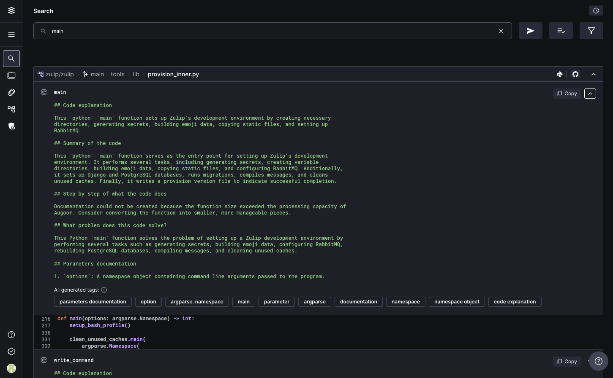

# Code Documentation

**Understanding Augoor’s code documentation:** 

**What is Augoor’s code documentation?**
Augoor’s code documentation feature is a breakthrough in understanding and navigating codebases. Powered by AI, it generates natural language documentation, seamlessly integrating it with your code. This integration forms a comprehensive search index, allowing you to explore using familiar terms or by navigating the code directly.

**Key Features of Augoor’s code documentation:**

1. **AI-generated explanations:**
    - **Parameter details:** Understand every function’s parameters with detailed explanations.
    - **Function documentation:** Access AI-crafted documentation for each function.
2. **Integrated and accessible:**
    - **Searchable documentation:** Both code and its AI-generated documentation are part of a single, searchable index.
    - **Natural language processing:** Our AI uses natural language, making the documentation intuitive and easy to grasp.

**How to Interact with the Documentation:**
Interacting with Augoor’s documentation is straightforward. As you navigate your code, the AI-generated explanations are displayed alongside, offering immediate insights and understanding. This integrated approach means you can access documentation without disrupting your coding flow.

**Preserving Existing Documentation:**
Your existing documentation is respected and untouched in your SCM account. Augoor displays it´s AI-generated documentation only in our platform, adding an additional layer of understanding without altering your original code.

**Efficient documentation generation:**

- **Rapid documentation:** Augoor can document 23 lines of code in just a second, significantly speeding up the documentation process.
- **High capacity processing:** Capable of handling 1 million lines every 10 hours, Augoor is designed for large-scale efficiency.