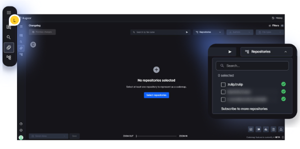
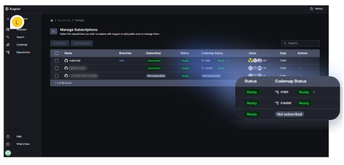

# Code Navigation

**Exploring Augoor’s Codemaps:**

**What is Augoor’s Codemap?**
Augoor's Codemap is an innovative feature that transforms complex code into easily understandable diagrams, offering real-time graphical mapping of your repositories. It's an invaluable tool for quickly grasping the context of any product, pinpointing problem sources, and facilitating issue resolution.

**Main functionalities of Codemaps:**

- **Project understanding:** Grasp the scale and organization of your projects at a glance.
- **Dependency visualization:** See how different code elements are interconnected.
- **Evolution tracking:** Monitor how your codebase evolves over time.
- **Legacy code identification:** Discover and assess outdated or unused code.
- **Codesmells identification:** Pinpoint a variety of codesmells, vulnerabilities, and bugs.
- **Complexity and issue detection:** Easily spot areas of high complexity and potential code issues.

## **Initial Setup:**

1. Access Codemap by clicking the “Codemap” icon on the sidebar. Ensure you are subscribed to at least one repository (refer to "How to subscribe to repositories").

2. Select repositories to display on the map from the available subscribed list. *Note: Check the “Manage subscriptions” panel to confirm the repository's readiness for Codemap.*

