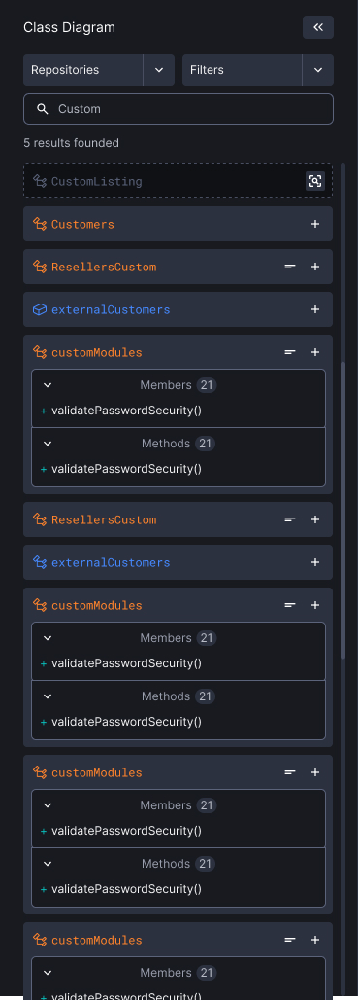
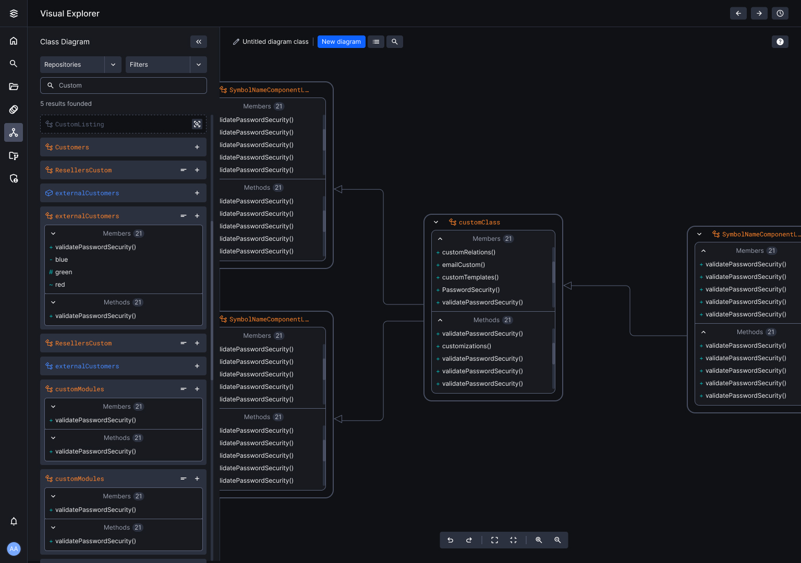

# What is Augoor’s Code Navigation?

Augoor’s Code Navigation provides powerful tools like class diagrams to help you visually explore and understand your system's structure and relationships. These diagrams are essential for both software architects and engineers, offering a clear view of how different parts of your code interact.

### How does code navigation help you?

1. **Class diagrams**:
    - **Visual representation**: Class diagrams offer a visual representation of your system's structure, showing how classes and modules are related.
    - **Understand architecture**: Quickly grasp the overall architecture, including key components and their interactions.
    - **Maintain consistency**: Keep track of changes over time to ensure architectural integrity.
2. **Module viewtype**:
    - **Code units**: Modules can be classes, collections of classes, layers, or any decomposition of code units.
    - **Properties and constraints**: Each module has properties and constraints that express important information and constraints on the module.
3. **Generalization style**:
    - **Class Hierarchies**: Shows how different code units relate to one another, often used in object-oriented designs.
    - **Support Maintenance**: Helps in identifying code to be repaired or reused, making maintenance more straightforward.

### Exploring code with Augoor

**Search panel**:

- **Execute queries**: Use the search panel to run queries and display search results.
- **Filters and selectors**: Refine your search using repository and branch selectors, programming language filters, and symbol type selectors.

**Canvas**:

- **Visual workspace**: Explore, construct, and visualize classes and global functions across repositories and branches.
- **Interactive interface**: Move, remove, and organize objects in your class diagrams.
- **UML standards**: Diagrams follow UML standards, showing classes, definitions, visibility (public, private, protected, package/internal), and types of relations (inheritance, composition, aggregation, association, dependency, realization).

### Enhancing Code Navigation with Augoor

1. **Visual Exploration**:
    - Create diagrams that show relationships between classes and modules, aiding in understanding the system's structure.
    - See connections between objects in the same repository and branch.
2. **Diagram Management**:
    - Share class diagrams for read-only access.
    - Keep diagrams up to date with source code changes.
    - Manage diagrams by removing or renaming them as needed.
3. **Contextual Information**:
    - Get information about objects, including names, symbol types, file paths, members, and function explanations (code explanation, summary, step-by-step breakdown, problem solved, parameter documentation).

### Why Use Augoor’s Code Navigation?

- Get a clear view of your project’s structure and relationships.
- Identify and resolve issues faster with visual insights.
- Use class diagrams to explain complex concepts to your team and stakeholders.
- Help new team members quickly understand the system.

By leveraging Augoor’s Code Navigation, you can enhance your understanding of your codebase, maintain high standards of software quality, and improve collaboration within your team.
