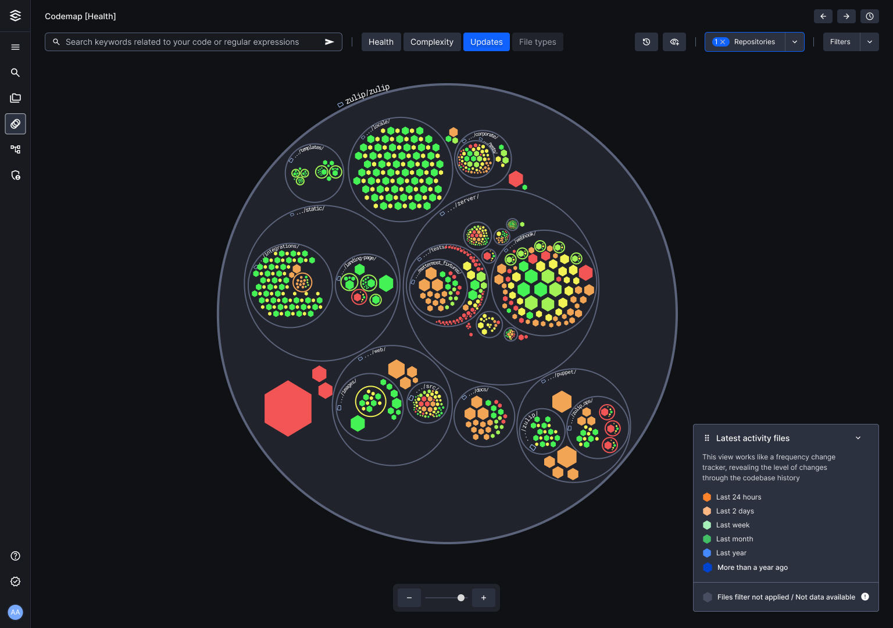

# Navigating Codemap

The graphics are highly intuitive and user-friendly, and file color gradients are shown depending on the active repositories.

- **Repository**: Go back to this filter whenever you need to check or uncheck the repositories you want to visualize.
- **Author**: A list of all Cloud provider authors subscribed to the repository(s) to be visualized.
- **File type**: A list of all file types available in the codebase or repositories currently visible in the code graph.

**You can navigate around Codemap using the following commands:**

- Drag the map by clicking and holding the left mouse button.
- Zoom in or zoom out using your mouse’s wheel or trackpad.
- You can also use the scrollbar at the bottom of the screen to zoom in and out.
- Double-click on a file or repository in the map to zoom in and view its details.

### **View options**

Codemap generates different color charts to visualize relevant information based on your selected view.

**1: Health**

It displays whether the file’s health level is good or critical and reveals errors. In this map, your codebase level of health is determined by: vulnerability, bugs & code smells.

| Good | Critical |
| --- | --- |
| Files with only a few vulnerabilities, bugs, or code smells in their code. | Vulnerable files with errors in certain lines of code. Or that contains a high percentage of code smells. |

**2: Complexity**

It shows code readability based on Cyclomatic complexity, which measures the number of decision points in a function, like loops or conditions. It helps you spot areas that might be harder to maintain or debug, allowing you to improve the code's readability and maintainability.

| Low | High |
| --- | --- |
| Functions with few decision points, such as simple loops or single conditions. | Functions with numerous decision points, like multiple loops, nested conditions, or complex control structures. |

**3: Updates**

It gives you a real-time overview of the latest changes and who implemented them, keeping you updated on your team's progress.

| Oldest | Latest |
| --- | --- |
| Files that have not been edited or updated for a more extended time. | Files with the most recent update date. |

**4: File type**

Helps you identify each file type in the map. Use it to dimension the size of your repository and the groups of files that compose them.

**5:** **File details panel**

After selecting the code you want to explore, a right-side panel will appear for you to check the file details. It includes five sections.

**File’s preview:** If the file is not analyzable, for example, if it contains text or images, you will see
