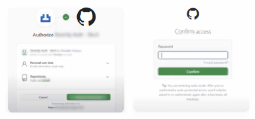
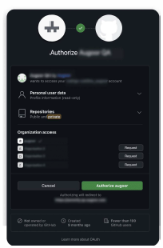

# Login and authentication

1. **Sign in with your SCM provider.** Augoor currently supports GitHub, Bitbucket, Gitlab, and Azure repositories.

2. **Permission Request.** The first time you log in, you will see a pop-up asking permission to access the SCM in your name and grant access to your repositories. (For security reasons, Augoor does not allow adding repositories from public domains to corporate domains and vice versa).

3. **Organization Access.** If there is more than one organization associated with your GitHub Enterprise account, you'll be able to request specific organization access in the authorization step. (This step may vary depending on your SCM provider).

