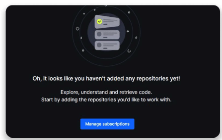
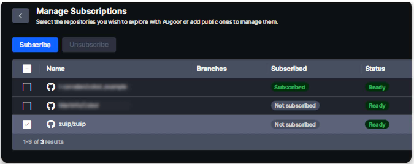

# Manage Repositries

**How to subscribe to repositories**

1. After logging in you will find a screen with the "Manage subscriptions" button.

2. Select the repositories you must work with and click "Subscribe". This way you will subscribe to the Main branch and all approved branches. You can explore only the repositories marked as "Ready". (Remember, only Admins and Gatekeepers in the team can add and approve repositories).

::: info Note
As a reference, it takes about 10 hours to process 1 million lines of code. Augoor documents approx. 23 lines of code per second).
:::

::: info Note
Once you subscribe to any Repository, if the initial status appears as "Error" contact your team Admin.
:::
