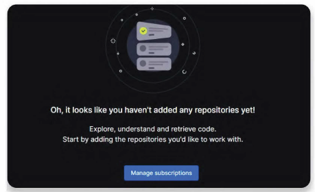
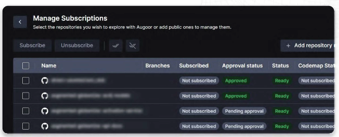
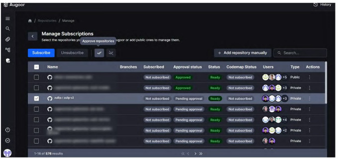
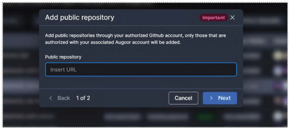
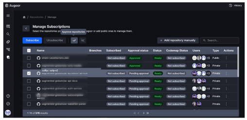

# Manage Subscriptions

As an Admin or Gatekeeper, you get full access and visibility of all repositories and branches available in the SCM account and are in charge of managing all the processing stages of repos.

**Empty state:** Once you log into Augoor, you can start setting up the teams' repositories by clicking the "Manage Subscriptions" button.

**Manage Subscriptions:** You'll be taken to the "Manage Subscriptions" panel to visualize the status of all repositories available according to your git provider account, approve or disapprove them, and add public ones.

**Approve or disapprove repos:** Admins and Gatekeepers can approve all repositories marked as "Ready" and "Pending approval". Select the repo and click the "Approve repositories" button. You can also disapprove them by clicking the "Disapprove repositories" button instead. This will determine the repositories the rest of the team has access to.

**Adding public repositories:** You can add public repositories by clicking the "Add public repository" button, inserting the public repo link, and clicking "Next".

**Administration panel:** Click on the Administration panel icon in the left-hand sidebar to further visualize the information related to the status of the repositories. You can also abort, clean, release, or force them and activate automatic sync.

In the last column of the panel, you'll find two actions:

- → **Trigger Repo processing:** Where you can choose to "Clean” or "Force" and click "Confirm".
- → **Update Repo properties:** Where you can check or uncheck its "Released" and "Sync periodically" status and click "Confirm".

### Panel's status:

| Status     | Description                                            |
|------------|--------------------------------------------------------|
| Aborted    | Processing was manually interrupted.                   |
| Cloning    | Makes a copy of the original repository to the database or updates the current copy. |
| Done       | Processing completed.                                  |
| Failed     | One or more issues presented during processing.        |
| New        | Just added.                                            |
| Processing | Parses the code, generates documentation, and TAGs.   |
| Queued     | In line to be processed.                               |
| Ready      | Ready to explore.                                      |

::: info Note
Repositories' status in the Administration panel are not automatically updated, in order to visualize the latest updates, refresh the page.
:::
