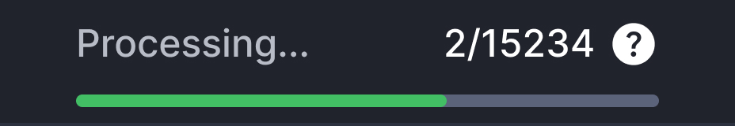
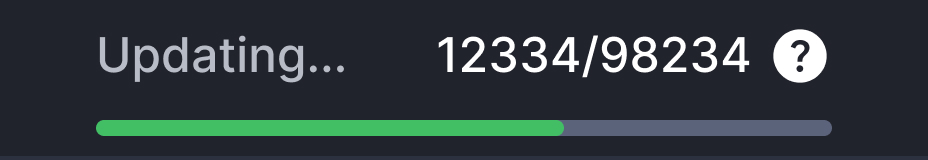
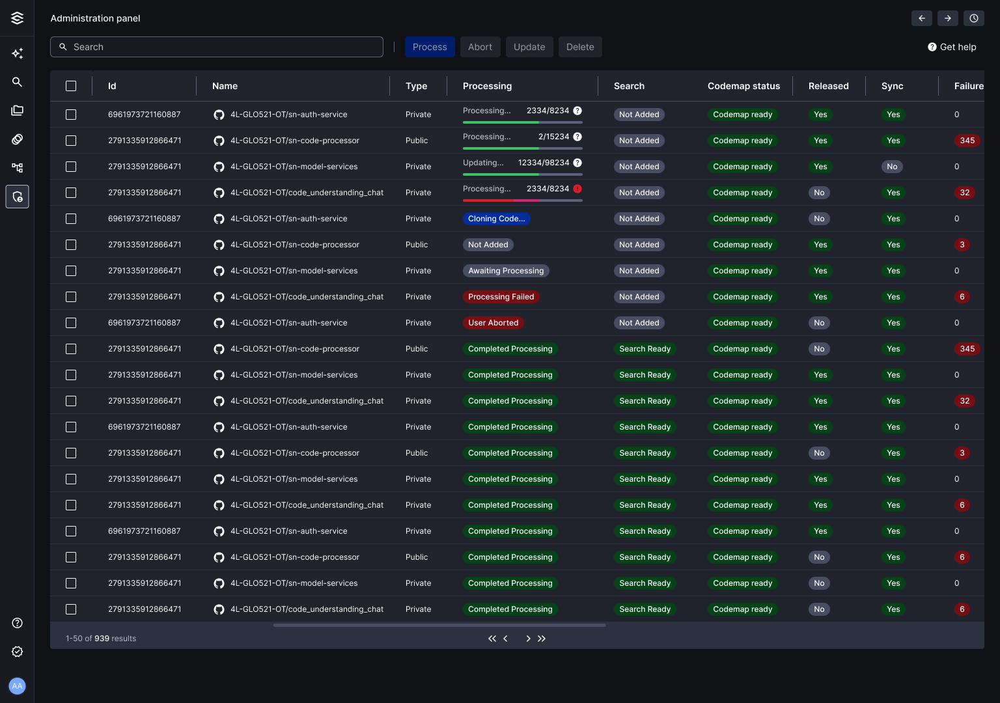

# Repositories Status

Keep track of your repositories' status in "Repositories" or in the "Manage Subscriptions" panel:

### Processing data status

<table>
  <tr>
    <td>
        
    </td>
    <td>
        
    </td>
  </tr>
  <tr>
    <td>
    <strong>Processing Data...</strong> 
    Note the process of file processing and metadata generation involves multiple stages and may take time in order ensure enhanced accuracy..
    </td>
    <td>
    <strong>Updating...</strong> 
    Updating repository with recent changes. This process syncs the latest modifications since the last update
    </td>
  </tr>
</table>

### Processing status

| Status               | Description                                                                 |
|----------------------|-----------------------------------------------------------------------------|
| Not added            | Indicates a repository has not yet been added to Augoor.                    |
| Awaiting processing  | Marks a repository that has been added to Augoor and is queued for processing. |
| Cloning code…        | Augoor is currently cloning the repository's code from the provider.        |
| Processing data…     | The repository is under processing within Augoor.                           |
| Processing failed    | The processing of the repository encountered errors and failed.             |
| Aborted              | The processing of the repository was manually aborted by a user.            |
| Completed Processing | The repository has been successfully processed by Augoor.                    |
| Removing             | The repository is currently being removed from Augoor.                      |
| Removed              | The repository has been successfully removed from Augoor.                   |
| Failed remove        | The attempt to remove the repository from Augoor failed.                    |

### Search Status

| Status       | Description                                                                                       |
|--------------|---------------------------------------------------------------------------------------------------|
| Not added    | A repo has not yet been added in Augoor.                                                          |
| Search Ready | Indicates readiness for executing searches in the repo.                                          |
| Unavailable  | The repository's metadata has either been attempted to be deleted or has been completely deleted. |

### Codemap Status

| Status             | Description                                                                                      |
|--------------------|--------------------------------------------------------------------------------------------------|
| Initialized        | When a spider stage starts.                                                                      |
| Processing data…   | During the execution of a spider stage.                                                          |
| Skipped            | Stage skipped due to a disabled flag or unmet execution condition, such as no deltas to process or rewrite disabled. |
| Failed             | A stage of the process throws an exception.                                                      |
| Completed          | A spider stage is completed successfully.                                                        |
| Succeeded          | A spider stage completes successfully and generates the necessary output to proceed in the process. |

And you will also visualize the “Approval status” column with the following options:

| Approval status | Description                                           |
| --------------- | ----------------------------------------------------- |
| Pending approval | A user has requested access to the repo and needs approval. |
| Approved         | You’ve successfully approved the use of this repo.   |

Only Admins: If you need to subscribe to specific branches from a Repository, click on the three dots from the “Actions” column and on “Subscribe repository”. A column with the available branches will display for you to select the ones to subscribe to. Once you approve this repository, only the branches you subscribed to will be available for Regular Users & Gatekeepers.

### Status repositories example 
 

:::info Note
If you already subscribed to the Main branch and it has been processed, once you want to change the branches to work with, you need to first unsubscribe to the repository, and then subscribe to the specific branches. Wait until the updates’ detection service to automatically reprocess it, or go back to the Admin panel and process that repository manually.
:::

:::info Note
Once you subscribe to a repository and its status appears as “Failed”, contact Augoor support to check on the repository Log.
:::

**Considerations**

- Augoor automatically reprocesses repositories with updates every 20 minutes; syncing must be finished to access the latest version. If there are any issues and a repository is not processed, contact your team Admin for manual reprocessing.
- Remember, you can always return to the "Repositories" section to check their status.

::: info Note
*If you are an Admin or Gatekeeper, go to the [Manage subscriptions](https://www.notion.so/Manage-subscriptions-4608d95c6e6240b993786cb4024ec059?pvs=21) with your special permissions from the get-go.*
:::
