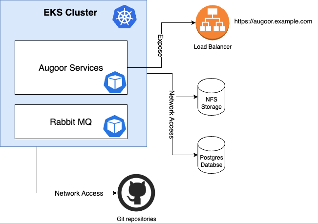

Augoor Installation Guide for Amazon Web Services{.guide-set-title}

# Step 2. Preparing the infrastructure
## Introduction
In this step you will prepare the infrastructure components required to install and deploy Augoor.

## Architecture Diagram


## Create the EKS Cluster
Full documentation on: [Creating an Amazon EKS cluster](https://docs.aws.amazon.com/eks/latest/userguide/create-cluster.html).

1. Create an Amazon EKS cluster IAM role:
```bash
cat >eks-cluster-role-trust-policy.json <<EOF
{
  "Version": "2012-10-17",
  "Statement": [
    {
      "Effect": "Allow",
      "Principal": {
        "Service": "eks.amazonaws.com"
      },
      "Action": "sts:AssumeRole"
    }
  ]
}
EOF

aws iam create-role --role-name $EKSClusterRole --assume-role-policy-document file://"eks-cluster-role-trust-policy.json"
aws iam attach-role-policy --policy-arn arn:aws:iam::aws:policy/AmazonEKSClusterPolicy --role-name $EKSClusterRole
```

2. Create a VPC:
```bash
VPC_ID=$(aws ec2 create-vpc --cidr-block $vnetCIDR --query Vpc.VpcId --output text)
aws ec2 create-tags --resources $VPC_ID --tags $tags
```

3. Create subnets for each component. For APP Subnet at least 2 availability zones is needed
```bash
SNET_APP_AZ1_ID=$(aws ec2 create-subnet --vpc-id $VPC_ID --cidr-block $snetappAZ1CIDR --availability-zone $availabilityZone1 --query Subnet.SubnetId --output text)
aws ec2 create-tags --resources $SNET_APP_AZ1_ID --tags $tags
SNET_APP_AZ2_ID=$(aws ec2 create-subnet --vpc-id $VPC_ID --cidr-block $snetappAZ2CIDR --availability-zone $availabilityZone1 --query Subnet.SubnetId --output text)
aws ec2 create-tags --resources $SNET_APP_AZ2_ID --tags $tags

SNET_STORAGE_ID=$(aws ec2 create-subnet --vpc-id $VPC_ID --cidr-block $snetstorageCIDR --query Subnet.SubnetId --output text)
aws ec2 create-tags --resources $SNET_STORAGE_ID --tags $tags
SNET_POSTGRES_ID=$(aws ec2 create-subnet --vpc-id $VPC_ID --cidr-block $snetpostgresCIDR --query Subnet.SubnetId --output text)
aws ec2 create-tags --resources $SNET_POSTGRES_ID --tags $tags
```
 
4. Create a security group for the VPC
```bash
SG_ID=$(aws ec2 create-security-group --group-name $securityGroupName --description $someDescription --vpc-id $VPC_ID --query GroupId --output text)
aws ec2 create-tags --resources $SG_ID --tags $tags
```

5. To create EKS Cluster execute
```bash
ACCOUNT_ID=$(aws sts get-caller-identity --query Account --output text)
aws eks create-cluster --region $location \
   --name $clusterName \
   --kubernetes-version 1.26 \
   --role-arn arn:aws:iam::$ACCOUNT_ID:role/$EKSClusterRole \
   --resources-vpc-config subnetIds=$SNET_APP_AZ1_ID,$SNET_APP_AZ2_ID
```


## Create a Load Balancer Controller
Full documentation on: [Installing the AWS Load Balancer Controller add-on](https://docs.aws.amazon.com/eks/latest/userguide/aws-load-balancer-controller.html).

1. Create an IAM Policy
```bash
curl -O https://raw.githubusercontent.com/kubernetes-sigs/aws-load-balancer-controller/v2.4.7/docs/install/iam_policy.json
aws iam create-policy \
   --policy-name AWSLoadBalancerControllerIAMPolicy \
   --policy-document file://iam_policy.json
```

2. Create an IAM role
```bash
ACCOUNT_ID=$(aws sts get-caller-identity --query Account --output text)
CLUSTER_OIDC=$(aws eks describe-cluster --name $clusterName --query "cluster.identity.oidc.issuer" --output text | awk -F"https://" '{ print $2 }')
cat >load-balancer-role-trust-policy.json <<EOF
{
    "Version": "2012-10-17",
    "Statement": [
        {
            "Effect": "Allow",
            "Principal": {
                "Federated": "arn:aws:iam::${ACCOUNT_ID}:oidc-provider/${CLUSTER_OIDC}"
            },
            "Action": "sts:AssumeRoleWithWebIdentity",
            "Condition": {
                "StringEquals": {
                    "${CLUSTER_OIDC}:sub": "system:serviceaccount:kube-system:aws-load-balancer-controller"
                }
            }
        }
    ]
}
EOF

aws iam create-role \
  --role-name AmazonEKSLoadBalancerControllerRole \
  --assume-role-policy-document file://"load-balancer-role-trust-policy.json"
aws iam attach-role-policy \
  --policy-arn arn:aws:iam::$ACCOUNT_ID:policy/AWSLoadBalancerControllerIAMPolicy \
  --role-name AmazonEKSLoadBalancerControllerRole
```

3. Create Kubernetes service account
```bash
cat >aws-load-balancer-controller-service-account.yaml <<EOF
apiVersion: v1
kind: ServiceAccount
metadata:
  labels:
    app.kubernetes.io/component: controller
    app.kubernetes.io/name: aws-load-balancer-controller
  name: aws-load-balancer-controller
  namespace: kube-system
  annotations:
    eks.amazonaws.com/role-arn: arn:aws:iam::${ACCOUNT_ID}:role/AmazonEKSLoadBalancerControllerRole
EOF

kubectl apply -f aws-load-balancer-controller-service-account.yaml
```

4. Install the AWS Load Balancer Controller
```bash
helm repo add eks https://aws.github.io/eks-charts
helm repo update
helm install aws-load-balancer-controller eks/aws-load-balancer-controller \
  -n kube-system \
  --set clusterName=$clusterName \
  --set serviceAccount.create=false \
  --set serviceAccount.name=aws-load-balancer-controller 
```

## Enable the Cluster to Download the images
We have 2 options configure the installation to pull the images:

* [Pull direct from Augoor Container Registry](#create-a-secret-to-authenticate-the-cluster-to-augoor-container-registry) 
* [Upload to a private repository and pull from there](#upload-images-to-your-registry) 

### Create a Secret to authenticate the cluster to Augoor Container Registry
1. Create the pull images secret 
```bash
kubectl create secret docker-registry acr-secret \
    --namespace $augoorNamespace \
    --docker-server=$acrName.azurecr.io \
    --docker-username=$servicePrincipalId \
    --docker-password=$servicePrincipalPwd
```

### Upload images to your registry
<!--@include: ../parts/mirroring_docker_images.md-->


## Create NFS Endpoint in the network of the Cluster
Full documentation on:
  * [Amazon EFS CSI driver](https://docs.aws.amazon.com/eks/latest/userguide/efs-csi.html).
  * [Create Mount Target](https://docs.aws.amazon.com/cli/latest/reference/efs/create-mount-target.html).

1. Create an IAM policy
```bash
curl -O https://raw.githubusercontent.com/kubernetes-sigs/aws-efs-csi-driver/master/docs/iam-policy-example.json
aws iam create-policy \
    --policy-name AmazonEKS_EFS_CSI_Driver_Policy \
    --policy-document file://iam-policy-example.json
```

2. Create IAM role
```bash
ACCOUNT_ID=$(aws sts get-caller-identity --query Account --output text)
CLUSTER_OIDC=$(aws eks describe-cluster --name $clusterName --query "cluster.identity.oidc.issuer" --output text | awk -F"https://" '{ print $2 }')
cat >trust-policy.json <<EOF
{
  "Version": "2012-10-17",
  "Statement": [
    {
      "Effect": "Allow",
      "Principal": {
        "Federated": "arn:aws:iam::$ACCOUNT_ID:oidc-provider/$CLUSTER_OIDC"
      },
      "Action": "sts:AssumeRoleWithWebIdentity",
      "Condition": {
        "StringEquals": {
          "$CLUSTER_OIDC:sub": "system:serviceaccount:kube-system:efs-csi-controller-sa"
        }
      }
    }
  ]
}
EOF

aws iam create-role \
  --role-name AmazonEKS_EFS_CSI_DriverRole \
  --assume-role-policy-document file://"trust-policy.json"
aws iam attach-role-policy \
  --policy-arn arn:aws:iam::$ACCOUNT_ID:policy/AmazonEKS_EFS_CSI_Driver_Policy \
  --role-name AmazonEKS_EFS_CSI_DriverRole
```

3. Create Kubernetes service account
```bash
ACCOUNT_ID=$(aws sts get-caller-identity --query Account --output text)
cat >efs-service-account.yaml <<EOF
---
apiVersion: v1
kind: ServiceAccount
metadata:
  labels:
    app.kubernetes.io/name: aws-efs-csi-driver
  name: efs-csi-controller-sa
  namespace: kube-system
  annotations:
    eks.amazonaws.com/role-arn: arn:aws:iam::$ACCOUNT_ID:role/AmazonEKS_EFS_CSI_DriverRole
EOF

kubectl apply -f efs-service-account.yaml
```

4. Install the Amazon EFS driver
```bash
helm repo add aws-efs-csi-driver https://kubernetes-sigs.github.io/aws-efs-csi-driver/
helm repo update
helm upgrade -i aws-efs-csi-driver aws-efs-csi-driver/aws-efs-csi-driver \
    --namespace kube-system \
    --set controller.serviceAccount.create=false \
    --set controller.serviceAccount.name=efs-csi-controller-sa
```

5. Create an Amazon EFS file system
```bash
VPC_ID=$(aws eks describe-cluster --name $clusterName --query "cluster.resourcesVpcConfig.vpcId" --output text)
EFS_SG_ID=$(aws ec2 create-security-group --group-name $EfsSecurityGroup --description $someDescription --vpc-id $VPC_ID --output text)
aws ec2 authorize-security-group-ingress \
    --group-id $EFS_SG_ID \
    --protocol tcp \
    --port 2049 \
    --cidr $SNET_STORAGE_ID
```

6. Create an Amazon EFS file system for the EKS cluster and mount target
```bash
FILE_SYSTEM_ID=$(aws efs create-file-system --region $location --performance-mode generalPurpose --query 'FileSystemId' --output text)
aws efs create-mount-target --file-system-id $FILE_SYSTEM_ID \
   --subnet-id $SNET_STORAGE_ID \
   --security-group $EFS_SG_ID
```

7. Create Augoor Directories Schema in the NFS
<!--@include: ../parts/directory_schema.md-->


## Create PostgreSQL Server
Augoor use a postgres database to store the list of projects, status, and user relations to create a database server for
it execute the following command, it creates a postgres database using AWS's [RDS](https://aws.amazon.com/rds/postgresql/) solution.

Full documentation on:
  * [RDS](https://aws.amazon.com/rds/postgresql/).
  * [Creating an Amazon RDS DB instance](https://docs.aws.amazon.com/AmazonRDS/latest/UserGuide/USER_CreateDBInstance.html).
  * [Create database instance](https://docs.aws.amazon.com/cli/latest/reference/rds/create-db-instance.html).

1. Create a DB subnet group
```bash
aws rds create-db-subnet-group \
    --db-subnet-group-name $subnetDBName \
    --db-subnet-group-description $someDesription \
    --subnet-ids '["$SNET_POSTGRES_ID"]' 
```

2. Create PostgreSQL server
```bash
aws rds create-db-instance \
    --db-instance-identifier $postgresName \
    --db-instance-class db.t3.micro \
    --vpc-security-group-ids $VPC_ID \
    --db-subnet-group-name $subnetDBName \
    --engine postgres \
    --master-username $postgresAdminUser \
    --master-user-password $postgresAdminPwd \
    --allocated-storage 20
```

3. Create a DataBase and the Admin user for Flyway
<!--@include: ../parts/create_db_user.md-->

## Install database complements
<!--@include: ../parts/create_db_complements.md-->