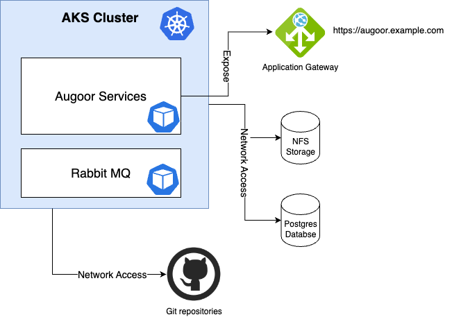

Augoor Installation Guide for Microsoft Azure{.guide-set-title}

# Step 2. Preparing the infrastructure
## Introduction
In this step you will prepare the infrastructure components required to install and deploy Augoor.

## Architecture Diagram


## Create the AKS Cluster
Full documentation on:
  * [Deploy an Azure Kubernetes Service cluster](https://learn.microsoft.com/en-us/azure/aks/learn/quick-kubernetes-deploy-cli).
  * [Create a virtual network](https://learn.microsoft.com/en-us/azure/virtual-network/quick-create-cli).
  * [AKS Deployment parameters](https://learn.microsoft.com/en-us/azure/aks/configure-azure-cni#deployment-parameters).

1. Create a Resource Group
```bash
az group create -n $RESOURCE_GROUP --location $location --tag $tags
```

2. Create a Virtual Network
```bash
az network vnet create --name $vnet --resource-group $RESOURCE_GROUP --location $location \
  --address-prefixes $vnetCIDR --subnet-name $snet --subnet-prefixes $snetCIDR --tag $tags
```

3. Create subnets for each component
```bash
az network vnet subnet create --name $snetapp --address-prefixes $snetappCIDR --vnet-name $vnet --resource-group $RESOURCE_GROUP
az network vnet subnet create --name $snetgateway --address-prefixes $snetgatewayCIDR --vnet-name $vnet --resource-group $RESOURCE_GROUP
az network vnet subnet create --name $snetstorage --address-prefixes $snetstorageCIDR --vnet-name $vnet --resource-group $RESOURCE_GROUP
az network vnet subnet create --name $snetpostgres --address-prefixes $snetpostgresCIDR --vnet-name $vnet --resource-group $RESOURCE_GROUP
```
 
4. To create AKS cluster execute and custom label for non-GPU node pool
```bash
az aks create -n $clusterName -g $RESOURCE_GROUP -l $location \                                  
  --max-pods 250 \
  --node-count 2 \
  --node-vm-size Standard_D4s_v3 \
  --enable-addons http_application_routing \
  --network-plugin azure \
  --vnet-subnet-id /subscriptions/$subscription/resourceGroups/$RESOURCE_GROUP/providers/Microsoft.Network/virtualNetworks/$vnet/subnets/$snet \
  --generate-ssh-keys \
  --docker-bridge-address 172.17.0.1/16 \
  --dns-service-ip $dns_svc_ip \
  --service-cidr $svcCIDR \
  --nodepool-name $NON_GPU_NODEPOOL \
  --tags $tags
 ```

5. To create a GPU node pool and its custom label
```bash
az aks nodepool add -n $GPU_NODEPOOL -g $RESOURCE_GROUP \
  --cluster-name $clusterName \
  --max-pods 100 \
  --node-count 1 \
  --node-vm-size Standard_ND6s \
  --vnet-subnet-id /subscriptions/$subscription/resourceGroups/$RESOURCE_GROUP/providers/Microsoft.Network/virtualNetworks/$vnet/subnets/$snet \
  --tags $tags  
```

6. Create the namespace for Augoor application
```bash
kubectl create namespace $AUGOOR_NAMESPACE
```

## Create a Load Balancer Controller
Full documentation on:
  * [Create a public IP address](https://learn.microsoft.com/en-us/azure/virtual-network/ip-services/create-public-ip-cli).
  * [Azure Application Gateway](https://learn.microsoft.com/en-us/azure/application-gateway/quick-create-cli).

1. Create public IP for the Application Gateway
```bash
az network public-ip create -n $AGPublicIPAddress -g $RESOURCE_GROUP --allocation-method Static --sku Standard
```

2. Create Application Gateway
```bash
#PUBLIC_IP=$(az network public-ip show --resource-group $RESOURCE_GROUP --name $publicipname --query ipAddress --output tsv)
az network application-gateway create --name $appGatewayName --resource-group $RESOURCE_GROUP --location $location \
  --sku Standard_v2 --capacity 2 --vnet-name $vnet --subnet $snetgateway --public-ip-address $AGPublicIPAddress --priority 100
```

3. To install Ingress Application Gateway Controller
```bash
APPGW_ID=$(az network application-gateway show -n $appGatewayName -g $RESOURCE_GROUP -o tsv --query "id") 
az aks enable-addons -n $clusterName -g $RESOURCE_GROUP -a ingress-appgw --appgw-id $APPGW_ID
```

## Enable the Cluster to Download the images
We have 2 options configure the installation to pull the images:

* [Pull direct from Augoor Container Registry](#create-a-secret-to-authenticate-the-cluster-to-augoor-container-registry) 
* [Upload to a private repository and pull from there](#upload-images-to-your-registry) 

### Create a Secret to authenticate the cluster to Augoor Container Registry
1. Create the pull images secret 
```bash
kubectl create secret docker-registry acr-secret \
    --namespace $augoorNamespace \
    --docker-server=$acrName.azurecr.io \
    --docker-username=$servicePrincipalId \
    --docker-password=$servicePrincipalPwd
```

### Upload images to your registry
<!--@include: ../parts/mirroring_docker_images.md-->


## Create NFS Endpoint in the network of the Cluster
Full documentation on:
  * [Network File System overview](https://learn.microsoft.com/en-us/windows-server/storage/nfs/nfs-overview).
  * [az storage](https://learn.microsoft.com/en-us/cli/azure/storage?view=azure-cli-latest).
  * [Create an Azure private DNS zone](https://learn.microsoft.com/en-us/azure/dns/private-dns-getstarted-cli).

1. Check if nfs capabilities is enable in your account
```bash
az feature show --name AllowNfsFileShares --namespace Microsoft.Storage --query properties.state
```

2. Enable nfs file shares as a Storage Capability if is not enable (optional depending of step 1)

```bash
az feature register --name AllowNfsFileShares --namespace Microsoft.Storage
az provider register --namespace Microsoft.Storage
```

3. Create an storage account 

```bash 
az storage account create \  
  --name $STACC \
  --resource-group $RESOURCE_GROUP \
  --location $location
  --sku Premium_LRS \
  --kind FileStorage
```

4. Disable secure transfer
```bash
az storage account update -g $RESOURCE_GROUP -n $STACC --https-only false
```

5. Create an Azure file share
```bash
 az storage share-rm create --resource-group $RESOURCE_GROUP --storage-account $STACC \
   --name augoorshare --quota 300 --enabled-protocol NFS --root-squash RootSquash
```

6. Create Endpoint to access to the storage account from the cluster network
```bash 
STORAGE_ACCOUNT_ID=$(az storage account show --name $STACC --resource-group $RESOURCE_GROUP --query "id" --output tsv)
az network private-endpoint create --connection-name $ConnectionName \
  --name $PrivateEndpointName \
  --private-connection-resource-id $STORAGE_ACCOUNT_ID \
  --location $location \
  --subnet $snetstorage \
  --resource-group $RESOURCE_GROUP \
  --group-id file
```

7. Create Private DNS Zone
```bash
az network private-dns zone create --resource-group $RESOURCE_GROUP --name $DNS_ZONE_NAME
```

8. Create private DNS associated to the Storage Account Endpoint
```bash 
PRIVATE_ENDPOINT_IP=$(az network private-endpoint show --name $PrivateEndpointName --resource-group $RESOURCE_GROUP --query "customDnsConfigs[0].ipAddresses[0]" --output tsv)
az network private-dns record-set a add-record --resource-group $RESOURCE_GROUP \
  --zone-name $DNS_ZONE_NAME --record-set-name @ --ipv4-address $PRIVATE_ENDPOINT_IP
```

9. Link Vnet with the DNS Zone
```bash
az network private-dns link vnet create --name $VNET_LINK_NAME \
  --registration-enabled false \
  --resource-group $RESOURCE_GROUP \
  --virtual-network $vnet \
  --zone-name $DNS_ZONE_NAME
```

10. Create Augoor Directories Schema in the NFS
<!--@include: ../parts/directory_schema.md-->

## Create PostgreSQL Server
Augoor use a postgres database to store the list of projects, status, and user relations to create a database server for
it execute the following command, it creates a postgres database using Azure's [flexible-server](https://learn.microsoft.com/en-us/azure/postgresql/flexible-server/overview) solution.

Full documentation on:
  * [flexible-server](https://learn.microsoft.com/en-us/azure/postgresql/flexible-server/overview).
  * [Create an Azure Database for PostgreSQL](https://learn.microsoft.com/en-us/azure/postgresql/flexible-server/quickstart-create-server-cli).

1. Create PostgreSQL server
```bash
SNET_POSTGRES_ID=$(az network vnet subnet show --name $snetpostgres --resource-group $RESOURCE_GROUP --vnet-name $vnet --query "id" --output tsv)
az postgres flexible-server create --name $postgresName \
  --resource-group $RESOURCE_GROUP \
  --location $location \
  --tier Burstable \
  --sku-name Standard_B1ms \
  --storage-size 32 \
  --subnet $SNET_POSTGRES_ID \
  --admin-user $postgresAdminUser \
  --admin-password $postgresAdminPwd
```

2. Create PostgreSQL Data Base
```bash
az postgres flexible-server db create --database-name augoor_db \
  --server-name $postgresName \
  --resource-group $RESOURCE_GROUP \
  --charset UTF8 \
  --collation en_US.UTF8 
```

3. Create a DataBase and the Admin user for Flyway
<!--@include: ../parts/create_db_user.md-->

## Install database complements
<!--@include: ../parts/create_db_complements.md-->