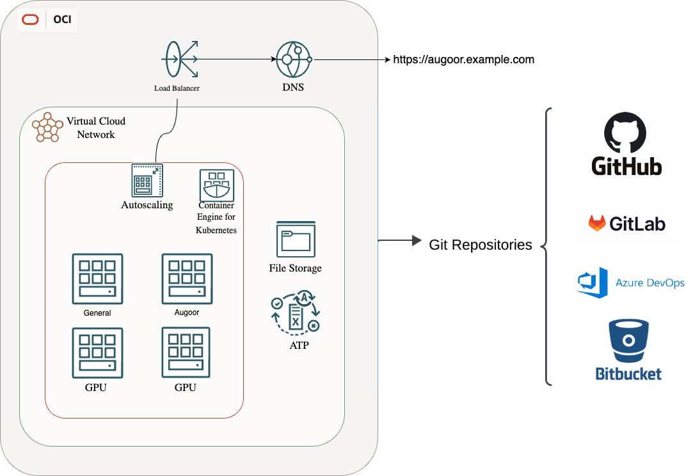

Augoor Installation Guide for Google Cloud Platform{.guide-set-title}

# Step 2. Preparing the infrastructure
## Introduction
In this step you will prepare the infrastructure components required to install and deploy Augoor.

## Architecture Diagram


## Create the OKE Cluster
Full documentation on:
  * [Working with Oracle CLI](https://docs.oracle.com/en-us/iaas/Content/API/SDKDocs/cliinstall.htm#Quickstart)
  * [Create and manage VNC and subnets networks](https://docs.oracle.com/en-us/iaas/Content/Network/Tasks/Overview_of_VCNs_and_Subnets.htm).
  * [Creating a OKE Cluster](https://docs.oracle.com/en-us/iaas/Content/ContEng/Tasks/create-cluster.htm).
  * [Accessing a Cluster Using Kubectl](https://docs.oracle.com/en-us/iaas/Content/ContEng/Tasks/contengaccessingclusterkubectl.htm)
  

1. Create a VNC
```bash
oci network vcn create --cidr-block "10.0.0.0/16" --compartment-id "COMPARTMENT_OCID" --display-name "MyVCN" --dns-label "myvcn"
```

2. Create subnets for Cluster nodes and pods
```bash
oci network subnet create --vcn-id "VCN_OCID" --cidr-block "10.0.1.0/24" --compartment-id "COMPARTMENT_OCID" --availability-domain "AVAILABILITY_DOMAIN" --display-name "MyPublicSubnet" --dns-label "mypubsubnet" --prohibit-public-ip-on-vnic false --route-table-id "VCN_ROUTE_TABLE_OCID" --security-list-ids '["SECURITY_LIST_OCID"]'
```
3. Create a OKE cluster
```bash
oci ce cluster create \
--name augoorEnhancedCluster \
--compartment-id $compartment_id \
--kubernetes-version $k8s_version \
--vcn-id $vnc_id \
--pods-cidr "10.244.0.0/16" \
--services-cidr "10.96.0.0/16" \
--endpoint-subnet-id $endpoint_subnet_id \
--service-lb-subnet-ids '["'$lb_subnet_id'"]' \
--endpoint-public-ip-enabled true \
--endpoint-nsg-ids '["'$nsg_id'"]' \
--type ENHANCED_CLUSTER
```
::: warning NOTE
Check [List OKE Node supported images](https://docs.oracle.com/en-us/iaas/images/oke-worker-node-oracle-linux-8x/).<br>
Check [List of compute shapes available](https://docs.oracle.com/en-us/iaas/Content/Compute/References/computeshapes.htm#Compute_Shapes).
:::

3. Create OKE Node Pool and custom label for non-GPU node pool
```bash
oci ce node-pool create \
--cluster-id $cluster_ocid \
--compartment-id $compartment_id \
--kubernetes-version $k8s_version \
--name "NodesCPU" \
--node-shape VM.Standard.E4.Flex \
--node-shape-config '{"memoryInGBs": 32.0, "ocpus": 8.0}' \
--node-boot-volume-size-in-gbs 120 \
--node-freeform-tags '{"nodepool": "NodesCPU"}' \
--size 2 \
--node-image-id $node_image_id \
--placement-configs '[{"availabilityDomain": "'$(oci iam availability-domain list --compartment-id $compartment_id --query 'data[0]."name"' --raw-output)'", "subnetId": "'$nodes_subnet_id'"}]' 
```

4. Create a OKE Node Pool GPU node pool and its custom label
```bash
oci ce node-pool create \
--cluster-id $cluster_ocid \
--compartment-id $compartment_id \
--name "NodeGPU" \
--kubernetes-version $k8s_version \
--node-shape VM.GPU.A10.1 \
--node-boot-volume-size-in-gbs 180 \
--node-freeform-tags '{"nodepool": "NodeGPU"}' \
--freeform-tags '{"nodepool": "NodeGPU"}' \
--initial-node-labels '[{"nodepool": "NodeGPU"}]' \
--size 1 \
--node-image-id $node_gpu_image_id \
--placement-configs '[{"availabilityDomain": "'$(oci iam availability-domain list --compartment-id $compartment_id --query 'data[0]."name"' --raw-output)'", "subnetId": "'$nodes_subnet_id'"}]' 
```

5. Configure Access to cluster 
```bash
oci ce cluster create-kubeconfig \ 
--cluster-id <cluster-ocid> \
--file $HOME/.kube/config \
--region <region> \
--token-version 2.0.0 
export KUBECONFIG=$HOME/.kube/config 
```

6. Create the namespace for Augoor application
```bash
kubectl create namespace $AUGOOR_NAMESPACE
```

## Enable the Cluster to Download the images
We have 2 options configure the installation to pull the images:

* [Pull direct from Augoor Container Registry](#create-a-secret-to-authenticate-the-cluster-to-augoor-container-registry) 
* [Upload to a private repository and pull from there](#upload-images-to-your-registry) 

### Create a Secret to authenticate the cluster to Augoor Container Registry
1. Create the pull images secret 
```bash
kubectl create secret \
docker-registry acr-secret \
--namespace $augoorNamespace \
--docker-server=$acrName.azurecr.io \
--docker-username=$AzureEcrUser \
--docker-password=$AzureEcrPassword
```

### Upload images to your registry
<!--@include: ../parts/mirroring_docker_images.md-->


## Create NFS Endpoint in the network of the Cluster
Full documentation on:
  * [Create a Filestore instance by using the gcloud CLI](https://docs.oracle.com/en-us/iaas/Content/File/Tasks/create-file-system.htm).
  * [Create a Mount Targets](https://docs.oracle.com/en-us/iaas/Content/File/Tasks/create-mount-target.htm#top).
  * [Create an Export](https://docs.oracle.com/en-us/iaas/Content/create-export-mt.htm)

1. Create File System 
```bash
oci fs file-system create \
--availability-domain bNgZ:US-ASHBURN-AD-1 \
--display-name "AugoorNFS" \
--compartment-id $compartment_id
```

2. Create Mount Target
```bash
oci fs mount-target create \
--compartment-id $compartment_id \
--availability-domain bNgZ:US-ASHBURN-AD-1 \
--subnet-id $nodes_subnet_id \
--display-name AugoorMountTarget
```

3. Create an Export
```bash 
oci fs export create \
--file-system-id $file_system_id \
--export-set-id $export_set_id \
--path /augoor
```

::: warning NOTE
Create security rules in VCN, open 2049 port.
:::

4. Create Augoor Directories Schema in the NFS
<!--@include: ../parts/directory_schema.md-->

## Create PostgreSQL Server
Augoor use a postgres database to store the list of projects, status, and user relations to create a database server for
it execute the following command, it creates a postgres database using OCI's [DbSystem Postgres](https://docs.oracle.com/en-us/iaas/Content/postgresql/getting-started.htm) solution.

Full documentation on:
  * [Create and manage databases](https://cloud.google.com/sql/docs/postgres/create-manage-databases).
  * [Connect to Cloud SQL for PostgreSQL from Google Kubernetes Engine](https://cloud.google.com/sql/docs/postgres/connect-instance-kubernetes).

1. Create Database
```bash
oci psql db-system create \
--display-name "$MY_OCI_DBSYSTEM_NAME" \
--compartment-id $MY_OCI_COMP_ID \
--db-version $MY_OCI_PG_VERSION \
--config-id $MY_OCI_CONFIG_ID \
--shape $MY_OCI_VM_SHAPE \
--instance-count $MY_OCI_NODES \
--instance-ocpu-count $MY_OCI_OCPUS \
--credentials '{"passwordDetails": {"passwordType":"VAULT_SECRET", "secretId":"'$MY_OCI_SECRET_ID'","secretVersion": "'$MY_OCI_SECRET_VERSION'"}, "username":"'$MY_OCI_ADMIN_USER'"}' \
--network-details '{"nsgIds":null, "primaryDbEndpointPrivateIp":null, "subnetId":"'$MY_OCI_SUBNET_ID'"}' \
--storage-details '{"availabilityDomain":"'$MY_OCI_AD'", "iops":"'$MY_OCI_IOPS'", "isRegionallyDurable":false, "systemType":"OCI_OPTIMIZED_STORAGE"}'
```


5. Create a DataBase and the Admin user for Flyway
<!--@include: ../parts/create_db_user.md-->

## Install database complements
<!--@include: ../parts/create_db_complements.md-->